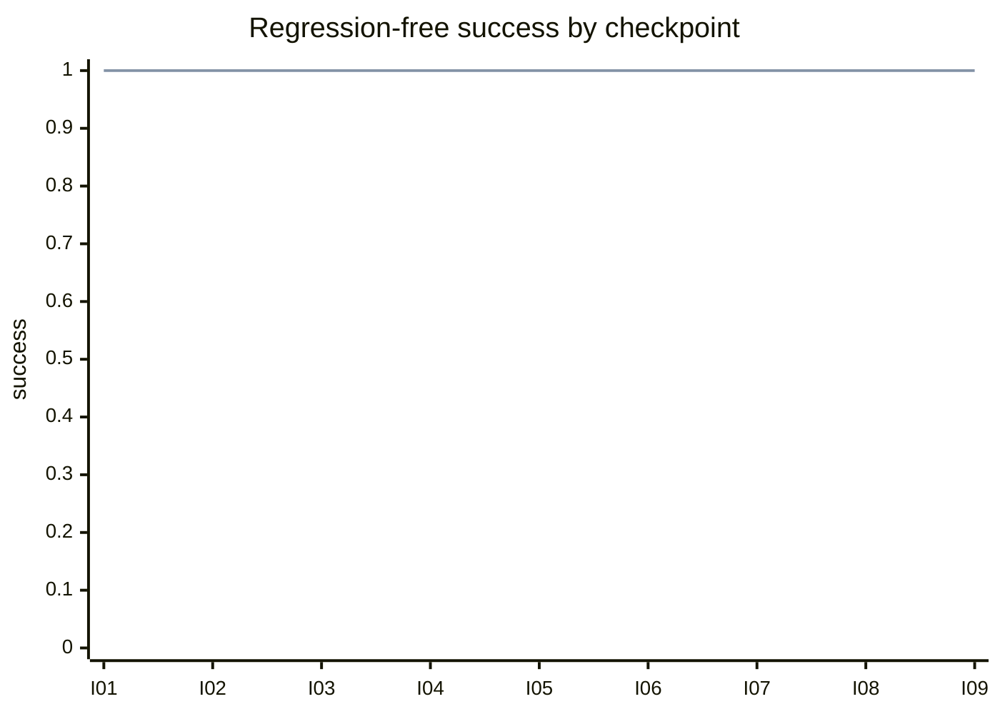

# Regression-Free Success: subscription-entitlements-difficulty-probe-20260605-009

Run classification: `difficulty_probe`

This plot is a public communication artifact for the clean Sonnet difficulty probe. It is not causal evidence.

## Source Run

- Run ID: `subscription-entitlements-difficulty-probe-20260605-009`
- Task version: `subscription-entitlements-lifecycle-v0`
- Provider/model: OpenRouter `anthropic/claude-sonnet-4.6`
- Budget: `max_model_turns=2`, `max_feedback_runs=1`
- Validity flags: none
- Replay mismatches: 0

## Regression-Free Success By Checkpoint

Regression-free success is `1` when all behavior accumulated through that checkpoint still passes hidden-oracle checks.

## Values

| Condition | I01 | I02 | I03 | I04 | I05 | I06 | I07 | I08 | I09 | AUC |
| --- | ---: | ---: | ---: | ---: | ---: | ---: | ---: | ---: | ---: | ---: |
| `context_only_spec` | 1 | 1 | 1 | 1 | 1 | 1 | 1 | 1 | 1 | 1.00 |
| `feedback_capable_spec` | 1 | 1 | 1 | 1 | 1 | 1 | 1 | 1 | 1 | 1.00 |

Regression-free AUC delta, feedback minus context: `0`.

## Interpretation

Both arms retained all accumulated behavior across all nine checkpoints in this clean difficulty probe. This makes the result useful as a public provider/task execution artifact, but it does not show a feedback advantage under this task/model/budget.
